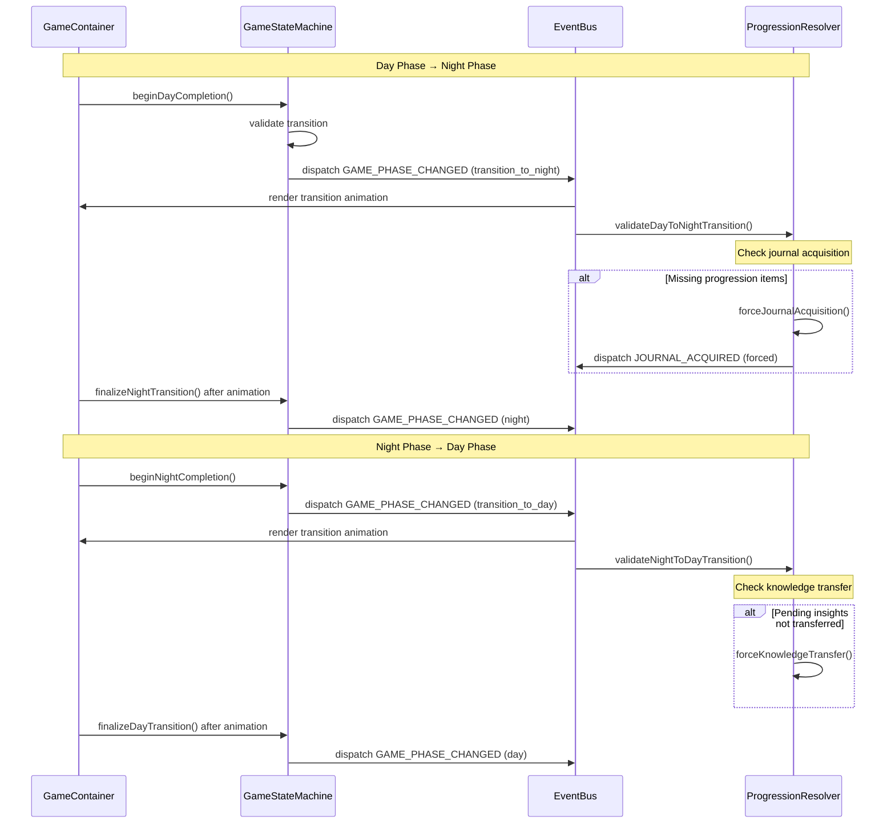

# Rogue Resident: Enhanced Systems Architecture


## Documentation Assessment and Enhancement

Looking at the initial documentation through the lens of a variety of potential development scenarios, I've identified several areas where the documentation could better serve as a comprehensive reference. The following sections expand on the initial documentation with greater implementation detail, error handling strategies, and extension patterns.

## 1. Expanded State Management Architecture

### Day/Night Transition Implementation



This enhanced diagram shows the complete transition flow including error recovery mechanisms. The ProgressionResolver provides a safety net for critical progression points.

### State Management Implementation

```typescript
// File: app/core/statemachine/GameStateMachine.ts

interface GameStateMachineState {
  gameState: GameState;             // 'not_started' | 'in_progress'
  gamePhase: GamePhase;             // 'day' | 'night' | 'transition_to_day' | 'transition_to_night'
  isTransitioning: boolean;         // Flag for transition animations
  transitionHistory: TransitionRecord[]; // For debugging
  completedNodeIds: string[];       // Nodes completed this day
  currentDay: number;               // Current day counter
  
  // State transition methods
  transitionToState: (newState: GameState, reason?: string) => boolean;
  transitionToPhase: (newPhase: GamePhase, reason?: string) => boolean;
  
  // Phase transition helpers
  beginDayCompletion: () => boolean;     // Day → transition_to_night
  beginNightCompletion: () => boolean;   // Night → transition_to_day
  finalizeDayTransition: () => void;     // transition_to_day → day
  finalizeNightTransition: () => void;   // transition_to_night → night
  
  // Progress tracking
  markNodeCompleted: (nodeId: string) => void;
  
  // Error recovery
  checkForStuckTransitions: () => boolean;
  resetState: (preserveMeta?: boolean) => void;
}
```

The state machine provides both the state values and the methods to manipulate state, ensuring all transitions go through proper validation and event dispatch.

### Error Recovery Mechanisms

```typescript
// File: app/core/progression/ProgressionResolver.ts

interface ProgressionResolverState {
  validateDayToNightTransition: () => boolean;  // Ensure journal exists
  validateNightToDayTransition: () => boolean;  // Ensure knowledge transferred
  
  // Emergency recovery methods
  forceJournalAcquisition: (source?: string) => boolean;
  forceKnowledgeTransfer: () => boolean;
  forceDayPhaseCompletion: () => boolean;
  forceNightPhaseCompletion: () => boolean;
}
```

The ProgressionResolver serves as a safety net for critical progression points, ensuring players can't get stuck due to race conditions or state inconsistencies.

## 2. Resource System Implementation

### Insight System Implementation

```typescript
// File: app/store/resourceStore.ts

// Insight thresholds for strategic actions
export const INSIGHT_THRESHOLDS = {
  REFRAME: 25,
  EXTRAPOLATE: 50,
  SYNTHESIS: 75,
  MAX: 100,
};

interface InsightState {
  insight: number;                   // Current insight points
  insightMax: number;                // Maximum possible (normally 100)
  insightEffect: {                   // Visual effect state
    active: boolean;
    duration: number;
    intensity: 'low' | 'medium' | 'high';
  };
  
  // Methods
  updateInsight: (amount: number) => void;
  setInsight: (value: number) => void;
  getInsightThresholdProximity: () => Record<string, number>; // For UI feedback
}
```

### Momentum System Implementation

```typescript
// File: app/store/resourceStore.ts

export const MAX_MOMENTUM_LEVEL = 3;

interface MomentumState {
  momentum: number;                   // Current momentum level (0-3)
  consecutiveCorrect: number;         // Streak counter
  momentumEffect: {                   // Visual effect state
    active: boolean;
    duration: number;
    intensity: 'low' | 'medium' | 'high';
  };
  
  // Methods
  incrementMomentum: () => void;
  resetMomentum: () => void;
  calculateMomentumMultiplier: () => number; // For insight calculations
}
```

### Strategic Actions Implementation

```typescript
// File: app/store/resourceStore.ts

export type StrategicActionType = 'reframe' | 'extrapolate' | 'boast' | 'synthesis';

interface StrategicActionState {
  activeAction: StrategicActionType | null;
  availableActions: {
    reframe: boolean;
    extrapolate: boolean;
    boast: boolean;
    synthesis: boolean;
  };
  
  // Methods
  activateAction: (actionType: StrategicActionType) => boolean;
  completeAction: (actionType: StrategicActionType, successful: boolean) => void;
  cancelAction: (actionType: StrategicActionType) => void;
  isActionAvailable: (actionType: StrategicActionType) => boolean;
}
```

### Action Registration Pattern

To extend the system with new actions:

1. Add the new action type to `StrategicActionType`
2. Define the action in `ACTION_DEFINITIONS` with cost, requirements, and effects
3. Implement the action handler in `actionHandlers` in `ActionIntegration.ts`
4. Add the action UI to `StrategicActions.tsx`

```typescript
// File: app/core/dialogue/ActionIntegration.ts

// Adding a new action example: 'reflect'
export type StrategicActionType = 'reframe' | 'extrapolate' | 'boast' | 'synthesis' | 'reflect';

const actionHandlers: Record<StrategicActionType, ActionHandlerFn> = {
  // Existing handlers...
  
  reflect: async (context: ActionContext) => {
    // Implementation for the new action
    return {
      stateUpdate: {
        text: "I need to reflect on what I've learned so far..."
      },
      newOptions: [
        // Custom reflection-specific options
      ]
    };
  }
};
```

## 3. Component Architecture Details

### Store Provider Pattern

```tsx
// File structure
/app
  /store
    gameStore.ts       // Game state, phase, nodes
    resourceStore.ts   // Insight, momentum, actions
    knowledgeStore.ts  // Concepts, connections, mastery
    journalStore.ts    // Journal entries, visibility
  /core
    /events
      CentralEventBus.ts  // Event pub/sub system
    /statemachine
      GameStateMachine.ts // Phase transitions
  /components
    GameContainer.tsx  // Root game component
```

All stores use Zustand with a consistent pattern:

```typescript
// Store creation pattern
export const useResourceStore = create<ResourceState & ResourceActions>()(
  (set, get) => ({
    // State
    insight: 0,
    momentum: 0,
    // ...more state
    
    // Actions
    updateInsight: (amount) => set(state => ({ 
      insight: Math.min(state.insight + amount, INSIGHT_THRESHOLDS.MAX) 
    })),
    // ...more actions
  })
);
```

### Component Render Optimization

Components follow these optimization patterns:

1. **Selective Subscription**: Components subscribe only to the specific state slices they need
2. **Memo & Callbacks**: React.memo and useCallback to prevent unnecessary rerenders
3. **Local UI State**: Keep purely visual state local to components

```tsx
// Example optimal component subscription
function InsightMeter() {
  // Only subscribe to what's needed, not the entire store
  const { insight, insightMax, insightEffect } = useResourceStore(
    state => ({
      insight: state.insight,
      insightMax: state.insightMax,
      insightEffect: state.insightEffect
    }),
    shallow // Use shallow comparison to prevent rerenders when other state changes
  );
  
  // Component implementation...
}
```

### Event System Implementation

```typescript
// File: app/core/events/CentralEventBus.ts

interface EventBusState {
  listeners: Map<GameEventType, Set<EventCallback>>;
  eventLog: GameEvent[];
  
  // Core methods
  subscribe: <T>(eventType: GameEventType, callback: EventCallback<T>) => () => void;
  subscribeMany: <T>(types: GameEventType[], listener: EventCallback<T>) => () => void;
  dispatch: <T>(eventType: GameEventType, payload: T, source?: string) => void;
  
  // Utilities
  getEventHistory: (eventType?: GameEventType, limit?: number) => GameEvent[];
}

// React hook for subscribing to events
export function useEventSubscription<T = any>(
  eventType: GameEventType | GameEventType[],
  callback: EventCallback<T>,
  dependencies: any[] = []
) {
  // Implementation...
}

// Helper functions
export function safeDispatch<T>(eventType: GameEventType, payload: T, source?: string) {
  // Implementation with error handling...
}
```

### UI Component Style Implementation

Styling follows these patterns:

1. **Theme constants**: Central definition of colors, sizes, animations
2. **Pixel-perfect components**: Common components for consistent styling
3. **Tailwind + custom CSS**: Hybrid approach for flexibility

```tsx
// File: app/components/PixelThemeProvider.tsx

export default function PixelThemeProvider({ children }) {
  return (
    <>
      {children}
      <style jsx global>{`
        /* Pixel rendering quality */
        .text-rendering-pixelated {
          text-rendering: optimizeSpeed;
          -webkit-font-smoothing: none;
        }

        /* Custom pixel borders with inset highlight */
        .pixel-borders {
          position: relative;
          border: 2px solid #0f172a;
          box-shadow: 0 0 0 1px rgba(0,0,0,0.3);
        }
        
        /* More global styles... */
      `}</style>
    </>
  );
}

// Common UI component with consistent styling
export function PixelButton({ 
  children, 
  className, 
  onClick, 
  variant = 'default', 
  size = 'md' 
}) {
  const variantClasses = {
    default: "bg-gray-800 border-gray-900 hover:bg-gray-700 text-white",
    clinical: "bg-clinical border-clinical-dark hover:bg-clinical-light text-white",
    // Other variants...
  };
  
  // Implementation...
}
```

## 4. Knowledge System Implementation

### Domain Color Constants

```typescript
// File: app/core/themeConstants.ts

// Domain color map for direct use
export const DOMAIN_COLORS: Record<KnowledgeDomain, string> = {
  'radiation-physics': '#3b82f6', // Blue
  'quality-assurance': '#10b981', // Green
  'clinical-practice': '#ec4899', // Pink
  'radiation-protection': '#f59e0b', // Amber
  'technical': '#6366f1',         // Indigo
  'theoretical': '#8b5cf6',       // Violet
  'general': '#6b7280',           // Gray
};

// Light variant colors for highlights
export const DOMAIN_COLORS_LIGHT: Record<KnowledgeDomain, string> = {
  'radiation-physics': '#93c5fd', // Light blue
  // Other colors...
};
```

### Knowledge Store Implementation

```typescript
// File: app/store/knowledgeStore.ts

export type KnowledgeDomain = 
  | 'radiation-physics'
  | 'quality-assurance'
  | 'clinical-practice'
  | 'radiation-protection'
  | 'technical'
  | 'theoretical'
  | 'general';

export interface ConceptNode {
  id: string;
  name: string;
  description: string;
  domain: KnowledgeDomain;
  mastery: number;
  position: { x: number; y: number };
  connections: string[];
  discovered: boolean;
}

export interface ConceptConnection {
  source: string;
  target: string;
  strength: number;
  discovered: boolean;
}

interface KnowledgeState {
  nodes: ConceptNode[];
  connections: ConceptConnection[];
  domainMastery: Record<KnowledgeDomain, number>;
  totalMastery: number;
  newlyDiscovered: string[];
  pendingInsights: { conceptId: string, amount: number }[];
  journalEntries: { 
    conceptId: string; 
    masteryGained: number; 
    timestamp: number; 
  }[];
  
  // Methods
  discoverConcept: (conceptId: string) => void;
  updateMastery: (conceptId: string, amount: number) => void;
  createConnection: (sourceId: string, targetId: string) => void;
  transferInsights: () => void;
  resetNewlyDiscovered: () => void;
}
```

### Adding a New Knowledge Domain

To extend the system with a new domain:

1. Add the domain to `KnowledgeDomain` type
2. Add domain colors to `DOMAIN_COLORS` and `DOMAIN_COLORS_LIGHT`
3. Register the domain in `KNOWLEDGE_DOMAINS` constant
4. Create concept nodes with the new domain

```typescript
// Adding 'patient-safety' domain
export type KnowledgeDomain = 
  | 'radiation-physics'
  // Existing domains...
  | 'patient-safety'; // New domain

// Add to domain colors
export const DOMAIN_COLORS: Record<KnowledgeDomain, string> = {
  // Existing domains...
  'patient-safety': '#ef4444', // Red for safety
};

// Add to knowledge domains configuration
export const KNOWLEDGE_DOMAINS: Record<KnowledgeDomain, { 
  name: string; 
  description: string; 
}> = {
  // Existing domains...
  'patient-safety': {
    name: 'Patient Safety',
    description: 'Protocols and practices to ensure patient wellbeing.'
  }
};
```

## 5. Persistence Implementation

### Store Persistence Structure

```typescript
// File: app/store/journalStore.ts

// Example of persistence implementation
export const useJournalStore = create<JournalState>()(
  persist(
    (set, get) => ({
      // State and actions...
    }),
    {
      name: 'rogue-resident-journal', // Local storage key
      storage: createJSONStorage(() => localStorage),
      // Only persist these keys
      partialize: (state) => ({
        hasJournal: state.hasJournal,
        currentUpgrade: state.currentUpgrade,
        entries: state.entries,
        characterNotes: state.characterNotes,
        customAnnotations: state.customAnnotations,
      }),
    }
  )
);
```

### Persistence Strategy by Store

| Store | Persistence Strategy | Storage Location | Keys Persisted |
|-------|----------------------|------------------|----------------|
| Journal | Full persistence | localStorage | hasJournal, currentUpgrade, entries, characterNotes, customAnnotations |
| Knowledge | Partial persistence | localStorage | nodes (discovered only), connections (discovered only), domainMastery, totalMastery |
| Resource | Minimal persistence | localStorage | insight, lastActionUsed |
| Game | Session only | N/A | Not persisted between sessions |

### State Recovery Implementation

```typescript
// File: app/core/init.ts

// Initialization and recovery logic
export function useCoreInitialization() {
  // State to track initialization
  const [initialized, setInitialized] = useState(false);
  
  // Initialization logic
  const initializeSystems = useCallback(() => {
    // 1. Initialize event bus
    // 2. Initialize state machine
    // 3. Initialize progression resolver
    // 4. Validate persisted state consistency
    // 5. Set up recovery mechanisms
  }, []);
  
  // Teardown and reinitialize
  const reinitialize = useCallback(() => {
    // Logic to cleanly tear down and restart
  }, []);
  
  // Effect to initialize on mount
  useEffect(() => {
    if (!initialized) {
      initializeSystems();
    }
    
    // Expose emergency recovery
    if (typeof window !== 'undefined') {
      (window as any).__FORCE_REINITIALIZE__ = reinitialize;
    }
    
    // Cleanup
    return () => {
      // Cleanup logic
    };
  }, [initialized, initializeSystems, reinitialize]);
  
  return { initialized, reinitialize };
}
```

## 6. Common Development Scenarios

### Adding a New Strategic Action

```typescript
// 1. Define the action type
// File: app/store/resourceStore.ts
export type StrategicActionType = 
  | 'reframe' 
  | 'extrapolate' 
  | 'boast' 
  | 'synthesis'
  | 'reflect'; // New action

// 2. Add to action definitions
export const ACTION_DEFINITIONS: Record<StrategicActionType, ActionDefinition> = {
  // Existing actions...
  reflect: {
    label: 'Reflect',
    description: 'Consider past experiences to find insights',
    cost: 40,
    requiresMomentum: 0,
    bgClass: 'bg-purple-600',
    borderClass: 'border-purple-800',
  }
};

// 3. Implement the action handler
// File: app/core/dialogue/ActionIntegration.ts
const actionHandlers: Record<StrategicActionType, ActionHandlerFn> = {
  // Existing handlers...
  reflect: async (context: ActionContext) => {
    // Implementation of the reflect action
    return {
      stateUpdate: {
        text: "I'll reflect on my experiences so far..."
      },
      newOptions: [
        // Reflection-specific options
      ]
    };
  }
};

// 4. Add UI component
// File: app/components/gameplay/StrategicActions.tsx
// Update the component to include the new action
```

### Adding a New Knowledge Domain

```typescript
// 1. Extend the domain type
// File: app/store/knowledgeStore.ts
export type KnowledgeDomain = 
  | 'radiation-physics'
  // Existing domains...
  | 'patient-safety'; // New domain

// 2. Add domain metadata
export const KNOWLEDGE_DOMAINS: Record<KnowledgeDomain, DomainInfo> = {
  // Existing domains...
  'patient-safety': {
    name: 'Patient Safety',
    description: 'Protocols and practices to ensure patient wellbeing.',
    connectedDomains: ['clinical-practice', 'quality-assurance'],
    masteryTiers: [25, 50, 75, 100]
  }
};

// 3. Add domain colors
// File: app/core/themeConstants.ts
export const DOMAIN_COLORS: Record<KnowledgeDomain, string> = {
  // Existing domains...
  'patient-safety': '#ef4444', // Red for safety
};

// 4. Create concept nodes in the new domain
const patientSafetyConcepts: Partial<ConceptNode>[] = [
  {
    id: 'incident-reporting',
    name: 'Incident Reporting',
    description: 'Protocols for reporting and analyzing treatment incidents.',
    domain: 'patient-safety',
    // Other properties...
  },
  // More concepts...
];
```

### Troubleshooting the Day/Night Transition

Common issues and solutions:

1. **Phase out of sync with UI**
   - Check `gamePhase` in `useGameState()`
   - Verify transition events are firing
   - Ensure `GameContainer` is responding to phase changes

2. **Journal not being acquired**
   - Check `ProgressionResolver` logs
   - Verify `NODE_COMPLETED` events are firing
   - Check `journalStore` state and persistence

3. **Knowledge not transferring to constellation**
   - Verify `pendingInsights` in `knowledgeStore`
   - Check `transferInsights` method is being called
   - Verify `KNOWLEDGE_TRANSFERRED` event is firing

4. **Stuck in transition state**
   - Check for stuck transitions via `state.checkForStuckTransitions()`
   - Force phase via debug tools: `window.__GAME_STATE_MACHINE_DEBUG__.forcePhase('day')`
   - Check transition timeouts in `GameStateMachine`

## 7. Debug Tools and Utilities

### Console Debug Tools

The following debug utilities are available in the browser console:

```javascript
// Game state machine debugging
window.__GAME_STATE_MACHINE_DEBUG__.getCurrentState()
window.__GAME_STATE_MACHINE_DEBUG__.forcePhase('night')
window.__GAME_STATE_MACHINE_DEBUG__.reset()

// Event system debugging
window.__EVENT_SYSTEM_DIAGNOSTICS__()

// Progression resolver debugging
window.__PROGRESSION_RESOLVER__.forceJournalAcquisition()
window.__PROGRESSION_RESOLVER__.getRecoveryLog()

// Transaction system debugging
window.__TRANSACTION_SYSTEM__.getAllTransactions()
window.__TRANSACTION_SYSTEM__.repair()

// Emergency systems reset
window.__FORCE_REINITIALIZE__()
```

### VerticalSliceDebugPanel Component

```tsx
// File: app/components/debug/VerticalSliceDebugPanel.tsx

// Provides UI access to common debug operations:
// - Force phase transitions
// - Trigger emergency recoveries
// - Display state information
// - Reset system state
```

This debug panel can be toggled with Ctrl+Shift+D and provides direct manipulation of game systems for testing.
